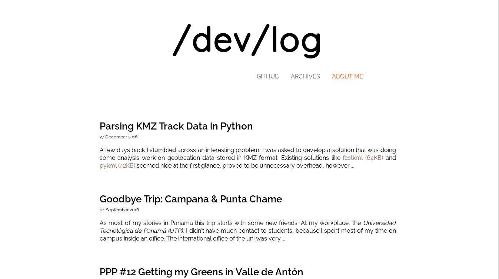
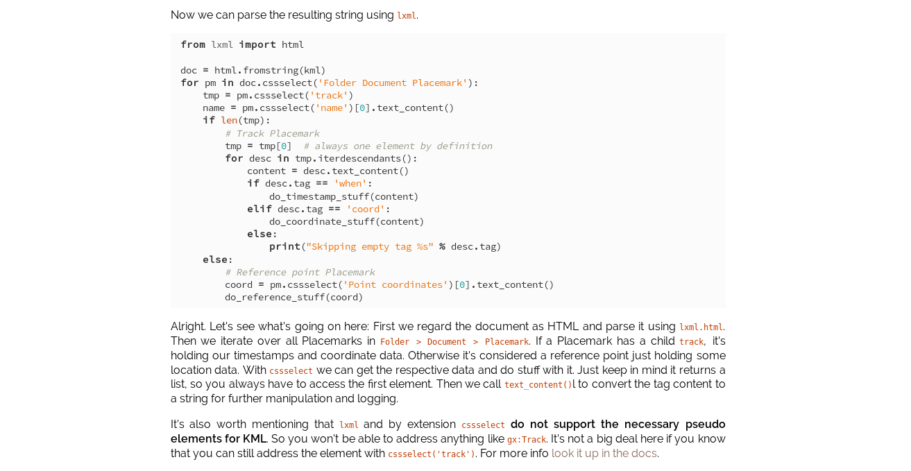

# hebe

A truly minimalist Pelican theme.
[Demo site](http://dmuhs.com)

## Screenshots

### Post Index



### Syntax Theme



## Features

- Custom Pygments Syntax highlighting theme
- CSS3 Animations - No JS needed!
- Pretty small codebase
- Google Analytics support

## Installation

In your Pelican site directory do

```bash
git submodule add https://github.com/dmuhs/hebe
```

Then set the `THEME` variable in your *pelicanconf.py* accordingly:

```python
THEME = 'hebe'
```

## Settings

This theme doesn't make use of the `authors`, `categories` and `tags` sites. Therefore
it is recommended to skip their generation by adding the following section to your conf:

```python
AUTHORS_SAVE_AS = ''
AUTHOR_SAVE_AS = ''
TAGS_SAVE_AS = ''
TAG_SAVE_AS = ''
CATEGORIES_SAVE_AS = ''
```

Direct access to e.g. `http://example.com/tags.html` will then result in a 404 instead
of showing a weird default template view.

- `SITENAME` Site title, shown in the banner
- `LINKS` Iterable of tuples `("NAME", "example.com")` to show in the menu
- `DISPLAY_ARCHIVE_ON_MENU` Show link to archive view in the navbar
- `SUMMARY_MAX_LENGTH` Maximum length of the summary displayed in the index
- `FOOTER TEXT` Text to display in the bottom footer - Default is `Made with ♥`
- `GOOGLE_ANALYTICS = 'UA-XXXXXXXX-X'` (in *publishconf.py*) to enable GA

For the other standard variables check out the [Pelican docs](http://docs.getpelican.com/en/latest/settings.html)

## Tips and Tweaks

For more ideas on how to make use of the theme check out the configuration of [my blog](https://github.com/dmuhs/dmuhs.github.io).
